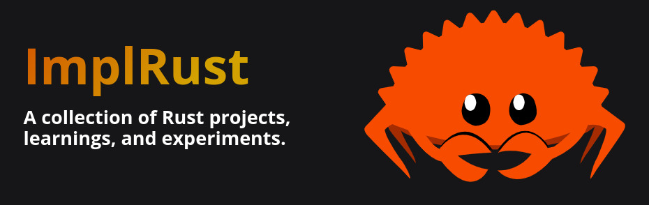

## Learning Resources
- [List of Resources to learn Rust - Roadmap From Beginner to Advanced Level](https://github.com/ImplFerris/LearnRust)
- [Collection of Free Rust Books](https://implrust.com/free-rust-books/)

## Free Books on Embedded Rust Programming
- [Pico Pico - Embedded Programming with Raspberry Pi Pico 2 and Rust](https://github.com/ImplFerris/pico-pico)
- [Embedded Programming with ESP32 and Rust](https://github.com/ImplFerris/esp32-book)
- [impl Rust for microbit](https://github.com/ImplFerris/microbit-book)
- [RED Book: Learn to write Embedded Rust Drivers](https://github.com/ImplFerris/Red-book)

## Embedded Rust Games
- [Dinosaur Game written in Rust for the ESP32](https://github.com/ImplFerris/esp32-rex)
- [Dinosaur Game written in Rust for the Raspberry Pi Pico 2 (RP2350)](https://github.com/ImplFerris/pico-rex)
- [Breakout Game written in Rust for the ESP32](https://github.com/ImplFerris/esp32-breakout-rust)
- [Flappy Bird Game written in Rust for the ESP32 with OLED Display](https://github.com/ImplFerris/esp32-flappy-bird)
- [Cosmic Yudh, shooting game written in Rust for the ESP32 with an OLED display](https://github.com/ImplFerris/esp32-cosmic-yudh)

## Other Embedded Projects
- [Smart Door Lock Simulation with Rust and ESP32](https://github.com/implferris/esp32-rfid-access)
- [A collection of songs for embedded programming projects using Rust](https://github.com/ImplFerris/rust-embedded-songs)
- [RTC HAL](https://github.com/implferris/rtc-hal)

